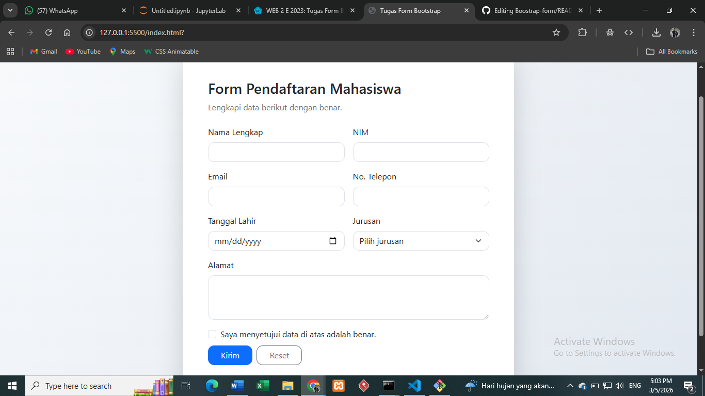

# Tugas Form Bootstrap

Proyek ini berisi implementasi **Form Bootstrap** untuk kebutuhan tugas.

## Fitur
- Menggunakan Bootstrap 5 untuk layout dan komponen.
- Form pendaftaran mahasiswa dengan input yang umum dipakai.
- Validasi sisi klien menggunakan mekanisme bawaan Bootstrap.
- Tampilan responsif untuk desktop dan mobile.

## Struktur File
- `index.html`: halaman utama form.
- `style.css`: styling tambahan.
- `DOKUMENTASI.md`: dokumen screenshot saat program running.
- `image/ss.png`: gambar hasil running.

## Menjalankan Proyek
1. Download/clone proyek.
2. Buka file `index.html` di browser.

## Link GitHub
Ganti placeholder berikut dengan link repo GitHub Anda setelah push:

`https://github.com/<username>/tugas-form-bootstrap`
